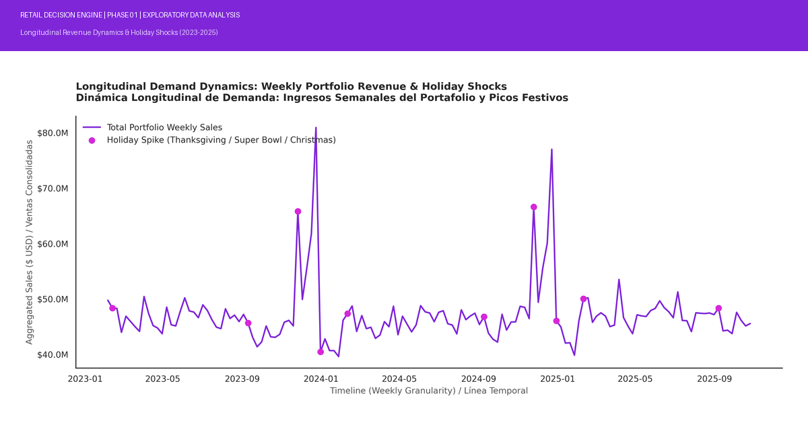

RETAIL SALES OPTIMIZATION & INVENTORY DECISION ENGINE
Motor de Optimizacion de Ventas Minoristas y Asignacion Prescriptiva de Inventarios
================================================================================

  

Stack Principal: Python 3.10+ | XGBoost | SHAP | PuLP | Pandas | Matplotlib
Licencia: MIT
Arquitectura: Pipeline Integral End-to-End

--------------------------------------------------------------------------------
1. RESUMEN EJECUTIVO / EXECUTIVE SUMMARY
--------------------------------------------------------------------------------

[EN] English:
This enterprise-grade portfolio project implements an end-to-end analytical 
framework for a major retail and self-service store chain (cadena de autoservicio). 
Spanning across 420,000+ historical multi-department transactions calibrated for 
the 2023-2025 fiscal horizon, the system bridges diagnostic business 
intelligence, gradient-boosted demand forecasting, and constrained operations 
research. The primary objective is to eliminate stockouts, prevent dead inventory, 
and maximize gross operating margin under strict physical warehouse footprint 
and working capital limitations.

[ES] Espanol:
Este proyecto de portafolio de nivel corporativo implementa un marco analitico 
integral para una importante cadena de tiendas de autoservicio. Abarcando mas 
de 420,000 transacciones historicas multidepartamentales calibradas para el 
horizonte fiscal 2023-2025, el sistema conecta inteligencia diagnostica de 
negocio, pronostico de demanda con ensambles de arboles e investigacion de 
operaciones con restricciones lineales. El objetivo central es mitigar quiebres 
de inventario, evitar acumulacion de stock inmovilizado y maximizar el margen 
operativo bruto bajo restricciones estrictas de presupuesto de capital y 
capacidad fisica de almacen.

--------------------------------------------------------------------------------
2. ARQUITECTURA DEL SISTEMA / SYSTEM PIPELINE
--------------------------------------------------------------------------------
| Directorio / Recurso | Módulos & Artefactos Clave | Propósito Operativo |
| :--- | :--- | :--- |
| **`notebooks/`** | `01_EDA_and_Engineering.ipynb` `02_Predictive_Models.ipynb` `03_Prescriptive_Analytics.ipynb` | Pipeline analítico secuencial: exploración, pronósticos supervisados y optimización prescriptiva. |
| **`data/`** | `raw/`, `processed/` | Ingesta transaccional original y almacenamiento curado (`retail_data_processed.csv`). |
| **`reports/figures/`** | Visualizaciones (`.png`), `banner_showcase.gif` | Gráficos diagnósticos estacionales, matrices SHAP y reporte visual para portafolio. |
| **Entorno & Setup** | `requirements.txt`, `make_banner.py` | Configuración determinista de librerías y utilidades de automatización. |

--------------------------------------------------------------------------------
3. FASES DEL PROYECTO / PROJECT BREAKDOWN
--------------------------------------------------------------------------------

FASE 1: Analisis Exploratorio de Datos e Ingenieria de Caracteristicas
(01_EDA_and_Engineering.ipynb)
- Armonizacion Relacional: Integracion relacional de tablas transaccionales, 
  metadatos de tiendas y series macroeconomicas (CPI, Unemployment, Fuel_Price).
- Protocolo de Imputacion: Relleno analitico de valores faltantes en descuentos 
  promocionales (MarkDown1-5).
- Descomposicion Temporal: Extraccion ciclica de fechas (Year, Month, Week) sobre 
  el horizonte modernizado 2023-2025, aislando picos por festivos comerciales.

FASE 2: Modelado Predictivo e Inteligencia Explicable
(02_Predictive_Models.ipynb)
- Motor Algoritmico: Regresion avanzada con XGBoost para capturar relaciones 
  no lineales complejas y varianza multidepartamental.
- Validacion Rigurosa: Particion temporal secuencial (Time-Series Split) para 
  evitar fuga de informacion (data leakage). Evaluacion via MAE, RMSE y R^2.
- XAI (Explainable AI): Descomposicion del impacto marginal de variables 
  mediante valores SHAP (Shapley Additive Explanations) basados en teoria de juegos.

FASE 3: Analitica Prescriptiva e Investigacion de Operaciones
(03_Prescriptive_Analytics.ipynb)
- Optimizacion Matematica: Formulacion de Programacion Lineal Entera (ILP) con PuLP.
- Funcion Objetivo: Maximizar el margen bruto total consolidado:
  Max Sum((Selling_Price_i - Unit_Cost_i) * Units_Ordered_i)
- Restricciones Operativas:
  * Presupuesto maximo de capital de trabajo: <= $450,000 USD.
  * Capacidad volumetrica del centro de distribucion: <= 1,000 m3.
  * Techo de demanda pronosticada: Units_Ordered_i <= Forecasted_Demand_i.

--------------------------------------------------------------------------------
4. TECNOLOGIAS Y PALETA VISUAL / TECH STACK & DESIGN
--------------------------------------------------------------------------------

- Stack de Datos: Python 3.10+, Pandas, NumPy.
- Machine Learning & Decision Science: XGBoost, SHAP, PuLP (Solver CBC).
- Visualizacion Cientifica: Matplotlib, Seaborn.
- Identidad Visual Analoga Estandarizada:
  * Foco Principal:        #7F26D9 (Morado Corporativo)
  * Acento Secundario:     #D926D9 (Magenta de Destaque)
  * Estructura Profunda:   #2626D9 (Azul Tecnico)
  * Linea Base / Neutral:  #B0BEC5 (Gris Neutro para Restricciones)

--------------------------------------------------------------------------------
5. GUIA DE REPRODUCIBILIDAD / QUICKSTART
--------------------------------------------------------------------------------

1. Clonar el repositorio:
   git clone https://github.com/Pablo-Santana-MX/retail-sales-optimization.git
   cd retail-sales-optimization

2. Crear entorno virtual e instalar dependencias:
   python -m venv .venv
   source .venv/bin/activate    # En Windows: .venv\Scripts\activate
   pip install -r requirements.txt

3. Ejecutar secuencialmente los cuadernos en notebooks/:
   - 01_EDA_and_Engineering.ipynb
   - 02_Predictive_Models.ipynb
   - 03_Prescriptive_Analytics.ipynb

--------------------------------------------------------------------------------
6. CONTACTO Y AUTORIA / AUTHORSHIP
--------------------------------------------------------------------------------

Pablo Alberto Santana Flores
Data Scientist | PhD in Marine Sciences | Engineering & Strategy

LinkedIn: https://mx.linkedin.com/in/pablo-santana-mx
GitHub:   https://github.com/Pablo-Santana-MX
================================================================================
